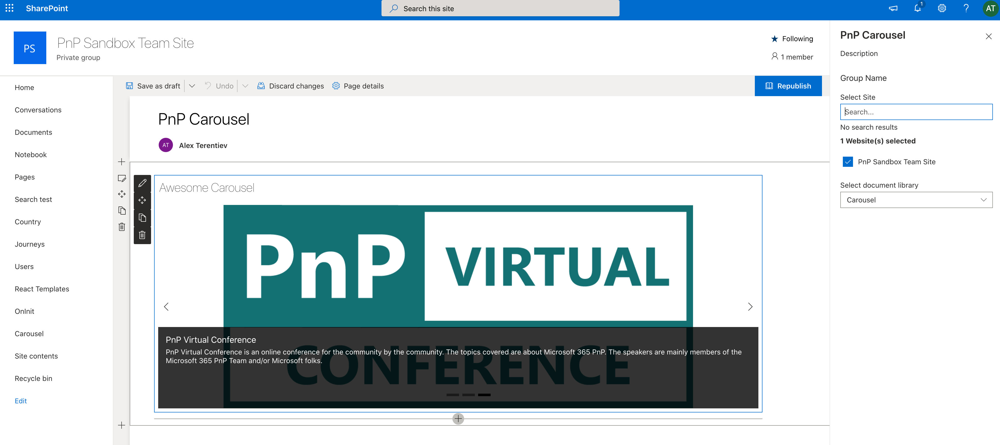

# pnp-controls

## Summary

Demo how to create Carousel web part using [PnP React Controls](https://pnp.github.io/sp-dev-fx-controls-react/) and [PnP Property Controls](https://pnp.github.io/sp-dev-fx-property-controls/)

## Used SharePoint Framework Version

## Applies to

- [SharePoint Framework](https://aka.ms/spfx)
- [Microsoft 365 tenant](https://docs.microsoft.com/en-us/sharepoint/dev/spfx/set-up-your-developer-tenant)

**Get your own free development tenant by subscribing to [Microsoft 365 developer program](http://aka.ms/o365devprogram)**

## Used Controls

- PnP React Controls
  - [Carousel](https://pnp.github.io/sp-dev-fx-controls-react/controls/Carousel/)
  - [Placeholder](https://pnp.github.io/sp-dev-fx-controls-react/controls/Placeholder/)
  - [WebPartTitle](https://pnp.github.io/sp-dev-fx-controls-react/controls/WebPartTitle/)
- PnP Property Controls
  - [PropertyFieldListPicker](https://pnp.github.io/sp-dev-fx-property-controls/controls/PropertyFieldListPicker/)
  - [PropertyFieldSitePicker](https://pnp.github.io/sp-dev-fx-property-controls/controls/PropertyFieldSitePicker/)

## Disclaimer

**THIS CODE IS PROVIDED *AS IS* WITHOUT WARRANTY OF ANY KIND, EITHER EXPRESS OR IMPLIED, INCLUDING ANY IMPLIED WARRANTIES OF FITNESS FOR A PARTICULAR PURPOSE, MERCHANTABILITY, OR NON-INFRINGEMENT.**

---

## Minimal Path to Awesome

- Clone this repository
- Ensure that you are at the solution folder
- in the command-line run:
  - `npm install`
  - `gulp serve`

## References
- [Microsoft 365 Patterns and Practices](https://aka.ms/m365pnp) - Guidance, tooling, samples and open-source controls for your Microsoft 365 development
